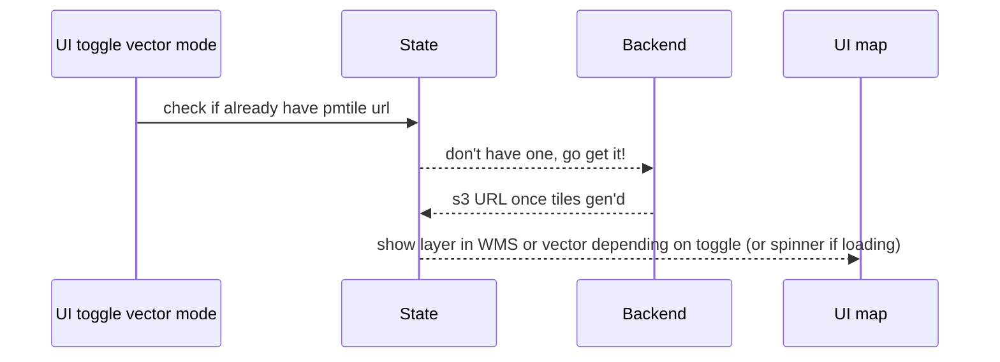

### Wet Paddlers API

#### Setup

`poetry install` (should create a venv for you automatically)

Copy the `.env.sample` to `.env` and configure your object store details

#### Run

`poetry run uvicorn api.main:app --reload`

Verify by `GET`ting the root endpoint at http://127.0.0.1:8000/ and checking the response is: `{"message":"Hello World"}`

#### OAS Spec

http://127.0.0.1:8000/docs

#### High level sequence for getting layers into vector:

